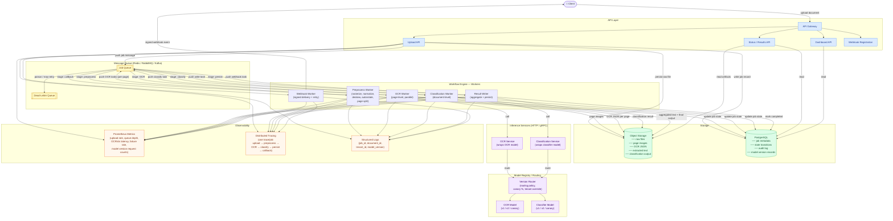

# Document OCR & Classification Inference Platform — System Design Diagram

```mermaid
flowchart TD
    Client(["👤 Client"])

    subgraph API_Layer["API Layer"]
        GW["API Gateway"]
        UA["Upload API"]
        SA["Status / Results API"]
        DA["Dashboard API"]
        WREG["Webhook Registration"]
    end

    subgraph Storage["Storage"]
        OS[("Object Storage\n── raw files\n── page images\n── OCR JSON\n── extracted text\n── classification output")]
        PG[("PostgreSQL\n── job metadata\n── state transitions\n── audit log\n── model version records")]
    end

    subgraph Queue["Message Queue (Redis / RabbitMQ / Kafka)"]
        MQ[["Job Queue"]]
        DLQ[["Dead-Letter Queue"]]
    end

    subgraph WorkflowEngine["Workflow Engine — Workers"]
        PW["Preprocess Worker\n(rasterize, normalize,\ndeskew, autorotate,\npage split)"]
        OCRW["OCR Worker\n(page-level, parallel)"]
        CLSW["Classification Worker\n(document-level)"]
        RW["Result Writer\n(aggregate + persist)"]
        WW["Webhook Worker\n(signed delivery + retry)"]
    end

    subgraph InferenceServices["Inference Services (HTTP / gRPC)"]
        OCR_SVC["OCR Service\n(wraps OCR model)"]
        CLS_SVC["Classification Service\n(wraps classifier model)"]
    end

    subgraph ModelRegistry["Model Registry / Routing"]
        MR["Version Router\n(routing policy,\ncanary %, tenant override)"]
        OCR_V["OCR Model\n(v1 / v2 / canary)"]
        CLS_V["Classifier Model\n(v1 / v2 / canary)"]
    end

    subgraph Observability["Observability"]
        PROM["Prometheus Metrics\n(upload rate, queue depth,\nOCR/cls latency, failure rate,\nmodel version request counts)"]
        TRACE["Distributed Tracing\n(one trace/job:\nupload → preprocess →\nOCR → classify → persist → callback)"]
        LOGS["Structured Logs\n(job_id, document_id,\ntenant_id, model_version)"]
    end

    %% Client → API
    Client -->|"upload document"| GW
    GW --> UA
    GW --> SA
    GW --> DA
    GW --> WREG

    %% Upload API → Storage + Queue
    UA -->|"persist raw file"| OS
    UA -->|"write job record"| PG
    UA -->|"push job message"| MQ

    %% Queue → Workers (stage: preprocess)
    MQ -->|"stage: preprocess"| PW
    PW -->|"page images"| OS
    PW -->|"update job state"| PG
    PW -->|"push OCR tasks (per-page)"| MQ

    %% Queue → Workers (stage: OCR)
    MQ -->|"stage: OCR"| OCRW
    OCRW -->|"call"| OCR_SVC
    OCR_SVC -->|"route"| MR
    MR --> OCR_V
    OCRW -->|"OCR JSON per page"| OS
    OCRW -->|"update job state"| PG
    OCRW -->|"push classify task"| MQ

    %% Queue → Workers (stage: classify)
    MQ -->|"stage: classify"| CLSW
    CLSW -->|"call"| CLS_SVC
    CLS_SVC -->|"route"| MR
    MR --> CLS_V
    CLSW -->|"classification result"| OS
    CLSW -->|"update job state"| PG
    CLSW -->|"push write task"| MQ

    %% Queue → Workers (stage: persist)
    MQ -->|"stage: persist"| RW
    RW -->|"aggregated text + final output"| OS
    RW -->|"mark completed"| PG
    RW -->|"push webhook task"| MQ

    %% Queue → Workers (stage: callback)
    MQ -->|"stage: callback"| WW
    WW -->|"signed webhook event"| Client
    MQ -->|"poison / max-retry"| DLQ

    %% Status & Dashboard reads
    SA -->|"read"| PG
    SA -->|"read artifacts"| OS
    DA -->|"read"| PG

    %% Observability taps
    UA & PW & OCRW & CLSW & RW & WW --> PROM
    UA & PW & OCRW & CLSW & RW & WW --> TRACE
    UA & PW & OCRW & CLSW & RW & WW --> LOGS

    %% Styles
    classDef service fill:#dbeafe,stroke:#3b82f6,color:#1e3a8a
    classDef storage fill:#dcfce7,stroke:#16a34a,color:#14532d
    classDef queue fill:#fef9c3,stroke:#ca8a04,color:#713f12
    classDef infra fill:#f3e8ff,stroke:#9333ea,color:#3b0764
    classDef obs fill:#fff7ed,stroke:#ea580c,color:#7c2d12

    class UA,SA,DA,WREG,GW service
    class OS,PG storage
    class MQ,DLQ queue
    class OCR_SVC,CLS_SVC,MR,OCR_V,CLS_V infra
    class PROM,TRACE,LOGS obs
```
